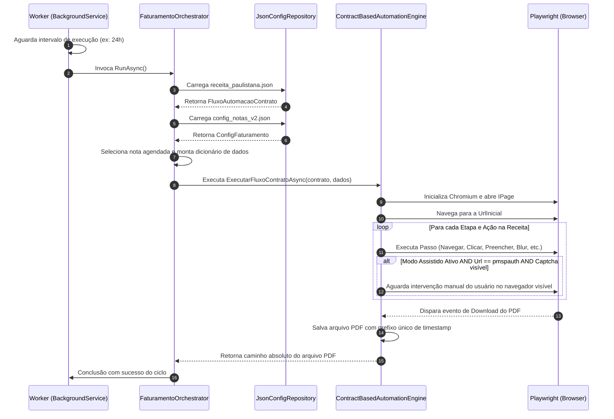

# Documentação do Projeto: Emissor de Nota Fiscal (EmissorNotaFiscal)

Este projeto é um serviço de automação (Worker Process) desenvolvido em **.NET 8.0** utilizando **Microsoft Playwright** para simular ações no navegador e emitir Notas Fiscais de Serviço Eletrônicas (NFS-e) na Prefeitura do Município de São Paulo (PMSP).

---

## 1. Stack Tecnológica

- **Linguagem**: C# / .NET 8.0
- **Automação de Navegador**: [Microsoft Playwright](https://playwright.dev/dotnet/) (Chromium)
- **Hospedagem**: Host Genérico do .NET (BackgroundService)
- **Configurações & DI**: Microsoft.Extensions.Configuration, Microsoft.Extensions.DependencyInjection, Microsoft.Extensions.Options
- **Notificação**: MailKit (estrutura preparada no código)
- **Persistência**: Arquivos locais em formato JSON (`System.Text.Json`)

---

## 2. Estrutura do Diretório e Componentes

A estrutura de código segue princípios de DDD (Domain-Driven Design) simplificado:

```text
EmissorNotaFiscal/
│
├── Program.cs                                # Bootstrapping, DI e configuração de opções
├── Worker.cs                                 # Serviço hospedado (BackgroundService) que roda periodicamente
│
├── Application/
│   └── FaturamentoOrchestrator.cs            # Orquestrador do fluxo de faturamento
│
├── Domain/
│   ├── Interfaces/
│   │   ├── IConfigRepository.cs              # Contrato para leitura/escrita de configurações JSON
│   │   └── INfeAutomationService.cs          # Contrato para o motor de automação Playwright
│   └── Models/
│       ├── Automation/                       # Contratos de receita/ações
│       │   ├── AcaoPasso.cs                  # Passo unitário da automação
│       │   ├── EtapaExecucao.cs              # Conjunto de passos (Etapa)
│       │   ├── FluxoAutomacaoContrato.cs     # Receita completa de automação
│       │   └── TipoAcao.cs                   # Enum das ações (Clicar, Preencher, etc.)
│       └── Faturamento/                      # Estruturas de dados de Notas Fiscais
│           ├── ConfigEmissor.cs              # Dados do emissor (prestador)
│           ├── ConfigFaturamento.cs          # Agendamentos de notas
│           └── ItemNota.cs                   # Dados da nota individual (cliente, valor, descrição)
│
├── Infrastructure/
│   ├── Automation/
│   │   └── ContractBasedAutomationEngine.cs  # Motor que traduz a receita JSON em ações Playwright
│   └── Storage/
│       └── JsonConfigRepository.cs           # Leitura e escrita de JSON no disco
│
├── appsettings.json                          # Configurações globais (SenhaWeb, Modo Assistido, Intervalo)
├── receita_paulistana.json                   # Receita (passo a passo) executada no portal
└── config_notas_v2.json                      # Notas fiscais agendadas para emissão
```

---

## 3. Fluxo de Execução

O fluxo de processamento funciona de forma orientada a contratos e receitas:



---

## 4. Estrutura de Receitas (JSON)

A automação é dirigida por dados através de uma receita estruturada (`receita_paulistana.json`). Cada ação suporta um `PlaywrightAcao` do tipo `TipoAcao` que é mapeado dinamicamente:

| Tipo de Ação (`TipoAcao`) | Descrição Técnica | Parâmetros Utilizados |
| :--- | :--- | :--- |
| `Navegar` | Vai até uma URL específica | `SeletorHtml` ou `ValorDinamicoChave` |
| `PreencherTexto` | Foca em um seletor e digita dados | `SeletorHtml` + `ValorDinamicoChave` |
| `ClicarBotao` | Clica em um botão ou link | `SeletorHtml` |
| `ClicarSeExistir` | Tenta clicar de forma opcional (timeout curto) | `SeletorHtml` |
| `DispararBlur` | Remove foco do seletor para rodar scripts JS nativos da página | `SeletorHtml` |
| `AguardarCarregamento` | Aguarda que a rede fique ociosa (`NetworkIdle`) | - |
| `TratarDialogos` | Escuta e aceita diálogos/popups de alerta nativos | - |

---

## 5. Mecanismo Atual de Captcha (Modo Assistido)

Atualmente, o robô possui um **Modo Assistido** configurado em `appsettings.json` através do bloco `Automation:AssistedMode`:

- **Deteção**: Monitora se a URL atual contém `pmspauth.prefeitura.sp.gov.br` e se algum seletor estrutural de desafio está presente no DOM (ex: `#mcaptcha__token-label`, `img[src*='captcha' i]`).
- **Comportamento**: Se detectado e `Enabled: true`, o navegador é aberto em modo visível (`Headless: false`). A execução é pausada, emitindo alertas em log.
- **Retomada**: O robô pesquisa se o captcha desapareceu e se elementos da próxima etapa ficaram visíveis. A retomada ocorre autonomamente se o usuário digitar o captcha e submeter na janela do navegador.
