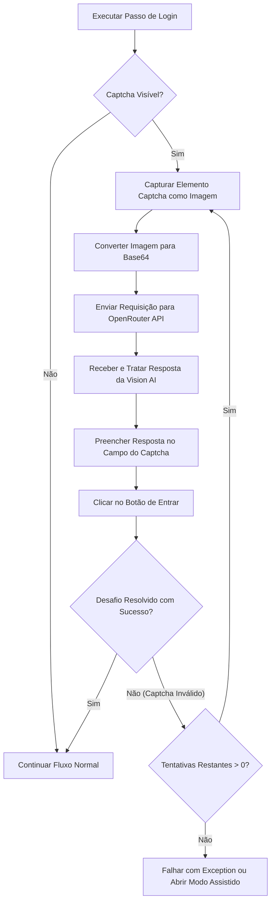

# Feature: Resolução Automática de Captcha com Vision AI (OpenRouter)

## 1. Contexto & Motivação

O portal de autenticação municipal (`pmspauth.prefeitura.sp.gov.br`) apresenta ocasionalmente uma tela de desafio (Captcha) do tipo imagem com caracteres alfanuméricos. Embora o **Modo Assistido** resolva isso pausando a automação e esperando a ação humana, no cenário de produção (onde o robô roda em segundo plano em um Worker autônomo sem supervisão), precisamos de um mecanismo totalmente automático e resiliente.

Utilizando modelos de visão computacional modernos via **OpenRouter**, conseguimos resolver esse captcha de forma flexível (podendo alternar o modelo de IA sem mexer no código) com alta acurácia e baixo custo operacional.

---

## 2. Arquitetura da Solução

O fluxo da feature consistirá nos seguintes passos dentro do ciclo de automação:



### Componentes a Serem Adicionados/Modificados

1. **`appsettings.json`**: Novas configurações para a API do OpenRouter e parametrização do resolvedor.
2. **`Configuration/CaptchaSolverOptions.cs`**: Classe C# para mapear as opções de configuração do resolvedor de captcha.
3. **`Domain/Interfaces/ICaptchaSolverService.cs`**: Interface para isolar o serviço de solução de captchas do motor Playwright.
4. **`Infrastructure/Automation/OpenRouterCaptchaSolver.cs`**: Implementação concreta do resolvedor de captchas que faz a chamada HTTP para a API do OpenRouter.
5. **`Infrastructure/Automation/ContractBasedAutomationEngine.cs`**: Integração do serviço no loop de automação, adicionando a verificação de captcha logo após a submissão de credenciais.

---

## 3. Configurações (`appsettings.json`)

Será introduzido um novo bloco de configuração no `appsettings.json` para controlar a feature:

```json
{
  "Automation": {
    "Headless": true,
    "SenhaWeb": "********",
    "AssistedMode": {
      "Enabled": false,
      "HumanInterventionTimeoutMinutes": 10
    },
    "CaptchaSolver": {
      "Enabled": true,
      "Provider": "OpenRouter",
      "ApiKey": "sk-or-v1-...",
      "Model": "google/gemini-2.5-flash",
      "MaxRetries": 3,
      "TimeoutSeconds": 15,
      "Selectors": {
        "CaptchaImage": "img:not(#bottle img)",
        "InputResponse": "input#ans",
        "SubmitButton": "button#jar",
        "ReloadButton": "a#bottle"
      }
    }
  }
}
```

---

## 4. Integração Playwright & Captura de Imagem

Para obter a imagem do Captcha, em vez de baixar a URL da imagem usando um `HttpClient` comum (o que poderia causar erro de sessão/cookie no portal), utilizaremos o recurso de **Screenshot de Elemento** do Playwright:

```csharp
// Localiza o elemento da imagem do Captcha
ILocator captchaImgLocator = page.Locator(options.Selectors.CaptchaImage);
await captchaImgLocator.WaitForAsync(new LocatorWaitForOptions { State = WaitForSelectorState.Visible });

// Tira screenshot apenas do elemento da imagem
byte[] screenshotBytes = await captchaImgLocator.ScreenshotAsync(new LocatorScreenshotOptions
{
    Type = ScreenshotType.Png
});

// Converte a imagem em string Base64 para envio na payload
string base64Image = Convert.ToBase64String(screenshotBytes);
string dataUrl = $"data:image/png;base64,{base64Image}";
```

---

## 5. Integração com a API do OpenRouter

O resolvedor de captcha enviará uma requisição HTTP POST para o endpoint do OpenRouter utilizando a estrutura padrão compatível com a API do OpenAI.

- **Endpoint**: `https://openrouter.ai/api/v1/chat/completions`
- **Headers**:
  - `Authorization: Bearer <ApiKey>`
  - `HTTP-Referer: https://github.com/Antigravity/EmissorNotaFiscal` (Identificação para o OpenRouter)
- **Prompt Utilizado**:
  - `"Analise a imagem de captcha fornecida. Retorne EXCLUSIVAMENTE os caracteres alfanuméricos contidos na imagem, sem formatação, sem espaços adicionais, sem explicações ou texto complementar. Sua resposta deve ser apenas o código do captcha resolvido."`

### Estrutura da Payload (JSON)

```json
{
  "model": "google/gemini-2.5-flash",
  "messages": [
    {
      "role": "user",
      "content": [
        {
          "type": "text",
          "text": "Analise a imagem de captcha fornecida. Retorne EXCLUSIVAMENTE os caracteres alfanuméricos contidos na imagem, sem formatação, sem espaços adicionais, sem explicações ou texto complementar. Sua resposta deve ser apenas o código do captcha resolvido."
        },
        {
          "type": "image_url",
          "image_url": {
            "url": "data:image/png;base64,iVBORw0KGgoAAAANS..."
          }
        }
      ]
    }
  ]
}
```

---

## 6. Lógica de Resiliência & Retentativas

A leitura de captchas por IA de visão não é 100% determinística. Por isso, a feature incluirá uma estratégia de retentativas:

1. **Submissão**: O robô digita o resultado no campo de texto e clica no botão de entrar.
2. **Verificação**: O robô verifica se a URL mudou ou se o seletor do captcha desapareceu.
3. **Detecção de Erro**: Se a página de login recarregar com uma mensagem de erro ("Código de segurança inválido" ou semelhante) ou se um novo elemento de captcha aparecer, o robô limpará o campo e fará um novo screenshot (já que o portal recarrega o captcha após uma tentativa falha).
4. **Fallback**: Se todas as tentativas (`MaxRetries`) falharem, o robô poderá:
   - Se `AssistedMode.Enabled` for `true`, acionar o fluxo humano de contingência.
   - Caso contrário, falhar com uma `AutomationExecutionException` descritiva.
