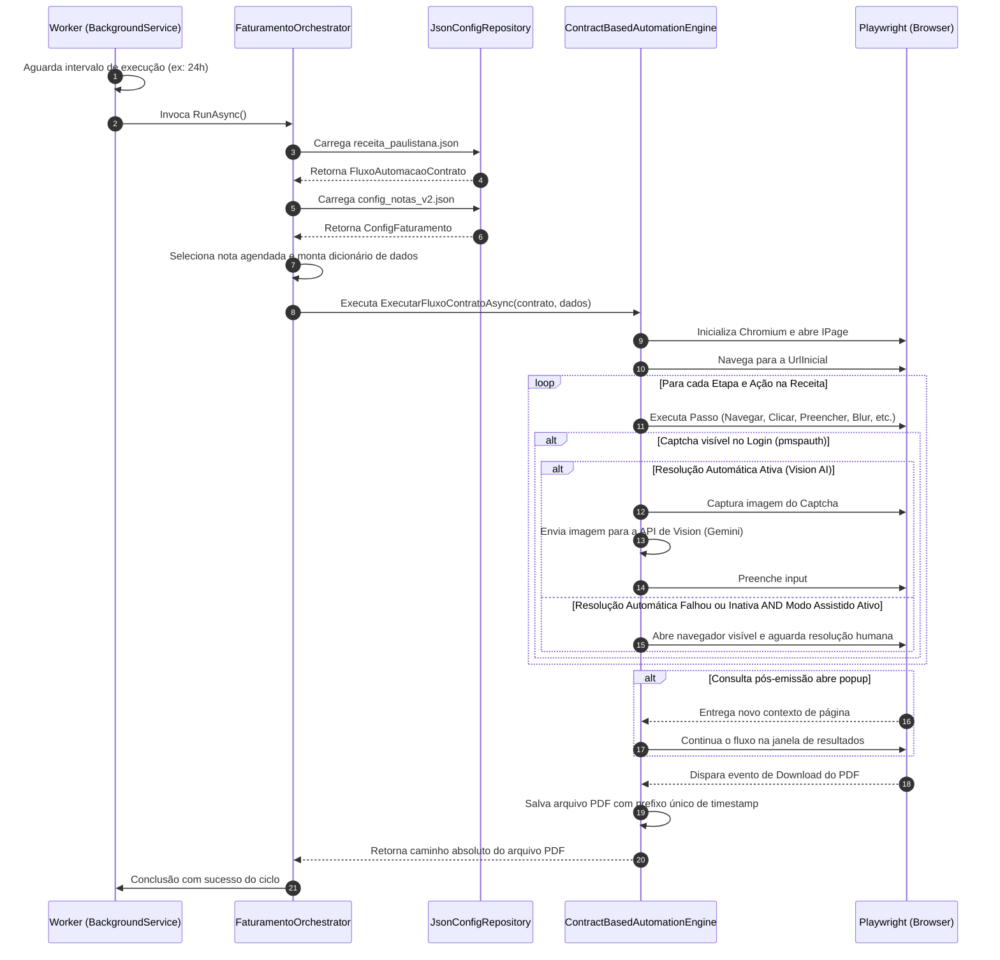

# 🏢 Emissor de Nota Fiscal Eletrônica (NFS-e) - RPA Paulistana

[](https://dotnet.microsoft.com/download/dotnet/8.0)
[](https://playwright.dev/dotnet/)
[]()

Este projeto é uma automação robotizada de processos (RPA) implementada como um **Worker Process em .NET 8**, utilizando o **Microsoft Playwright** para emular interações em navegador de forma robusta e otimizada. O principal objetivo é automatizar o fluxo completo de login, preenchimento, emissão, consulta e download do PDF oficial das Notas Fiscais de Serviços Eletrônicas (NFS-e) diretamente no portal da **Prefeitura do Município de São Paulo (PMSP / NFS-e Paulistana)**.

---

## ⚡ Principais Funcionalidades

*   **Motor Baseado em Contratos (Dinamismo)**: As etapas de navegação e interações HTML não estão hardcoded. O robô interpreta uma receita estruturada em JSON ([receita_paulistana.json](file:///f:/Projetos/AI/playwright/EmissorNotaFiscal/receita_paulistana.json)), permitindo ajustes de seletores ou inclusão de novos passos sem necessidade de recompilar a aplicação.
*   **Resolução de Captcha via Vision AI**: Ao deparar-se com desafios de Captcha na autenticação do portal (`pmspauth`), o robô captura o elemento da imagem do Captcha, envia para modelos de computação visual (como `gemini-2.5-flash`) via API compatível com OpenAI, e insere a resposta de forma autônoma.
*   **Modo Assistido de Fallback (Manual)**: Caso todas as tentativas automáticas de resolução da IA falhem ou a funcionalidade esteja desabilitada, o robô abre o navegador com interface gráfica (`Headless: false`), pausa a execução e aguarda que o operador resolva o desafio manualmente, retomando a execução de forma autônoma logo em seguida.
*   **Consulta Pós-Emissão e Download do PDF**: Logo após disparar a emissão da nota, o robô executa a consulta retroativa filtrando por CPF/CNPJ do tomador e competência atual. Ele identifica o link dinâmico da nota gerada na janela popup de resultados e efetua o download do arquivo PDF oficial no diretório local.
*   **Fail-Fast de Permissões**: Antes de inicializar recursos pesados do navegador, a automação valida a existência e a permissão de escrita no diretório parametrizado para downloads, reportando falhas de configuração imediatamente.

---

## 🏗️ Arquitetura e Estrutura do Projeto

O projeto adota uma estrutura modular inspirada nos princípios de DDD (*Domain-Driven Design*), isolando regras de negócio de detalhes de infraestrutura e persistência:

```text
EmissorNotaFiscal/
│
├── Program.cs                                # Bootstrapping, DI (Injeção de Dependência) e Configurações
├── Worker.cs                                 # Serviço hospedado (BackgroundService) com execução recorrente
│
├── Application/
│   └── FaturamentoOrchestrator.cs            # Orquestrador de fluxo e carregamento de contratos
│
├── Domain/
│   ├── Interfaces/
│   │   ├── IConfigRepository.cs              # Contrato de persistência de configurações JSON
│   │   ├── ICaptchaSolverService.cs          # Contrato do resolvedor de Captcha via Vision AI
│   │   └── INfeAutomationService.cs          # Contrato de serviços do motor do Playwright
│   └── Models/
│       ├── Automation/                       # Tipagens e enums de receita/ações
│       │   ├── AcaoPasso.cs
│       │   ├── EtapaExecucao.cs
│       │   ├── FluxoAutomacaoContrato.cs
│       │   └── TipoAcao.cs
│       └── Faturamento/                      # Entidades de Notas Fiscais e Agendamentos
│           ├── ConfigEmissor.cs
│           ├── ConfigFaturamento.cs
│           └── ItemNota.cs
│
├── Infrastructure/
│   ├── Automation/
│   │   ├── ContractBasedAutomationEngine.cs  # Motor concreto do Playwright que traduz a receita JSON
│   │   └── OpenAiCompatibleCaptchaSolver.cs # Resolvedor de Captcha via API compatível com OpenAI
│   └── Storage/
│       └── JsonConfigRepository.cs           # Leitor/Gravador de configurações no disco
│
├── appsettings.json                          # Parâmetros operacionais do robô
├── receita_paulistana.json                   # Receita passo a passo interpretada pelo motor
└── config_notas_v2.json                      # Notas fiscais agendadas para processamento
```

---

## ⚙️ Fluxo de Execução Técnica

Abaixo está o diagrama do ciclo de vida de uma rodada de faturamento executada pelo RPA:



---

## 🔧 Configuração e Preparação

### 1. Parâmetros da Aplicação (`appsettings.json`)
Configure o comportamento global da automação:
```json
{
  "Automation": {
    "Headless": true,
    "DownloadsDirectory": "F:\\Projetos\\AI\\playwright\\EmissorNotaFiscal\\downloads",
    "AssistedMode": {
      "Enabled": true,
      "HumanInterventionTimeoutMinutes": 10
    },
    "CaptchaSolver": {
      "Enabled": true,
      "BaseUrl": "https://generativelanguage.googleapis.com/v1beta/openai/chat/completions",
      "ApiKey": "SUA_API_KEY_DO_GEMINI_AQUI",
      "Model": "gemini-2.5-flash",
      "MaxRetries": 3,
      "TimeoutSeconds": 15,
      "Selectors": {
        "CaptchaImage": "img:not(#bottle img)",
        "InputResponse": "input#ans",
        "SubmitButton": "button#jar",
        "ReloadButton": "a#bottle"
      }
    }
  }
}
```

### 2. Contrato de Notas Fiscais (`config_notas_v2.json`)
Cadastre os dados de emissão e os agendamentos das notas:
```json
{
  "Emissor": {
    "Usuario": "SEU_USUARIO_PMSP",
    "SenhaWeb": "SUA_SENHA_WEB"
  },
  "Agendamentos": [
    {
      "CnpjCliente": "12345678000199",
      "CodigoServico": "03233",
      "ValorServico": "1500.00",
      "DescricaoServico": "Consultoria e desenvolvimento de sistemas de automação.",
      "Aliquota": "2.00",
      "EmailCliente": "financeiro@cliente.com"
    }
  ]
}
```

---

## 🚀 Como Executar

### Pré-requisitos
1.  **SDK do .NET 8.0** instalado na máquina.
2.  Ferramenta de comandos do PowerShell ou Terminal.

### Passos para Inicialização

1.  **Restaurar as dependências do projeto**:
    ```bash
    dotnet restore
    ```

2.  **Instalar os binários do navegador necessários para o Playwright**:
    Caso execute pela primeira vez na máquina, instale os navegadores do Playwright usando o comando abaixo:
    ```bash
    # Execute a compilação primeiro para gerar a ferramenta do Playwright
    dotnet build
    
    # Instale os navegadores
    pwsh bin/Debug/net8.0/playwright.ps1 install chromium
    ```

3.  **Rodar a aplicação**:
    ```bash
    dotnet run
    ```

---

## 🔒 Recomendações de Segurança

> [!WARNING]
> Nunca envie suas senhas e chaves de acesso diretamente em repositórios Git públicos ou compartilhados.

Para ambientes de homologação e produção, prefira gerenciar dados sensíveis (como a propriedade `SenhaWeb`) utilizando:
*   **User Secrets** do .NET em ambiente local de desenvolvimento.
*   **Variáveis de Ambiente** (`Environment Variables`) no servidor onde o RPA rodará.

---

## 🗺️ Próximas Funcionalidades (Roadmap)

- [ ] **Envio Automático do PDF da NF-e para o Cliente**: Módulo integrado para disparar e-mails contendo o PDF oficial anexado assim que o download for finalizado pelo robô.
- [ ] **Persistência de Logs em Arquivos `.txt`**: Registro estruturado e rotativo de logs locais para auditoria facilitada de erros de rede, falhas de seletor ou falhas operacionais do portal.

---

## 📄 Licença

Este projeto é de uso restrito e privado. Qualquer reprodução ou distribuição sem consentimento prévio está sujeita a termos legais.
