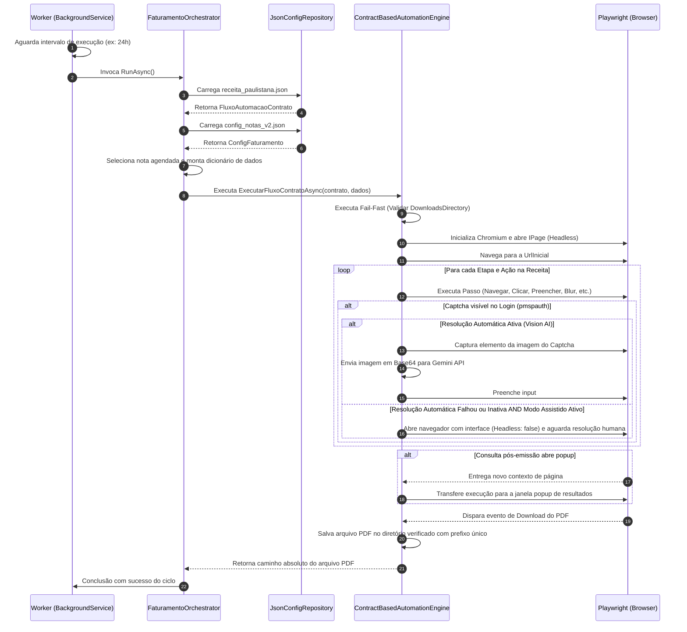

# 🏢 Primeiro Caso de Uso: Emissão de NFS-e Paulistana

Este documento detalha o cenário real de teste de estresse utilizado para validar a flexibilidade e a robustez da **Contract-Driven Automation Engine (CDAE)**: a emissão de Notas Fiscais de Serviços Eletrônicas da Prefeitura de São Paulo (PMSP).

---

## 1. Justificativa de Escolha

O portal da NFS-e Paulistana foi escolhido por conter características operacionais complexas e desfavoráveis que desafiam RPAs tradicionais:

1.  **Múltiplos Contextos de Autenticação**: A entrada no portal exige acesso via Single Sign-On (`pmspauth`), onde o campo de entrada do CNPJ e Senha Web é envelopado em caixas do tipo "sanfona" (accordions) que ocultam elementos do DOM dependendo do estado da sessão anterior.
2.  **Validações Cadastrais por Perda de Foco (Blur)**: O formulário de emissão valida o CNPJ ou CPF do tomador emitindo requisições assíncronas assíncronas do lado do servidor (AJAX). O motor precisa realizar interações físicas específicas de perda de foco (`blur`) e aguardar a estabilização da tela para continuar preenchendo.
3.  **Resultados em Popups**: A conclusão da emissão e as listagens de busca de notas abrem novas abas sem URLs fixas pre-definidas.
4.  **Download Baseado em Eventos de Navegador**: O download do documento PDF oficial não ocorre via requisição direta do tipo `GET` a um arquivo estático, mas através do clique em controles HTML que geram retornos dinâmicos com cabeçalhos HTTP contendo anexos.

---

## 2. Posicionamento e Escopo de Integração

A automação executada pelo motor baseia-se na simulação de ações do usuário no navegador de forma controlada e resiliente.

> 🛑 **Importante**: Esta automação **não visa competir ou substituir a integração convencional via APIs estruturadas/Web Services oficiais** baseadas em XML assinados com certificados digitais (padrão ABRASF).

Ela serve como uma **contingência e alternativa viável** para cenários corporativos onde:
*   Não há interesse ou possibilidade de aquisição de certificados digitais e-CNPJ/e-CPF A1 para o escopo de faturamento.
*   Burocracias de homologação, tarifas de licenciamento ou barreiras de desenvolvimento impedem a implantação imediata de integrações oficiais por Web Services.
*   Deseja-se reproduzir em ambiente monitorado o fluxo que seria feito manualmente por um operador humano.

---

## 3. Fluxo de Execução Técnica do Caso de Uso

O motor processa o faturamento da nota fiscal executando o pipeline mapeado no seguinte grafo lógico:

```mermaid
flowchart TD
    Contract[Contrato JSON\nreceita_paulistana.json] --> Orch[FaturamentoOrchestrator]
    Data[Payload Notas\nconfig_notas_v2.json] --> Orch
    Orch --> Check[Validação Antecipada de Infraestrutura\nDiretórios de Escrita]
    Check --> Launch[Inicialização do Playwright\nChromium Context]
    Launch --> Pipeline[Processador de Etapas Sequenciais]
    
    Pipeline --> Challenge{Captcha\nDetectado?}
    Challenge -- Sim --> VisionAI{Vision AI\nAtivo?}
    VisionAI -- Sim --> Solve[Capturar Elemento Imagem\nEnviar p/ Gemini LLM VLM\nPreencher & Submeter]
    Solve --> Ver{Sucesso?}
    Ver -- Não --> Assisted[Modo Assistido\nNavegador Headless: False\nAguardar Operador (Timeout)]
    Ver -- Sim --> NextStep[Próxima Etapa do Contrato]
    VisionAI -- Não --> Assisted
    Assisted --> NextStep
    Challenge -- Não --> NextStep
    
    NextStep --> ActionMap[Interpretar Ação\nPreencher / Clicar / Dropdown / Blur]
    ActionMap --> HandlePopup{Popup de\nResultado?}
    HandlePopup -- Sim --> SwitchTab[Transferir Contexto Playwright\npara a nova IPage]
    HandlePopup -- Não --> Target{Ação Download\nAlcançada?}
    SwitchTab --> Target
    
    Target -- Sim --> Capture[Capturar Evento de Download\nSalvar no Filesystem]
    Target -- Não --> Pipeline
    Capture --> Complete[Faturamento Concluído\nRetornar Caminho do PDF]
```

### Detalhamento Sequencial do Ciclo de Vida



---

## 4. Estrutura de Contrato e Exemplo de Payload

Para a emissão de nota em São Paulo, o interpretador lê o contrato do arquivo [receita_paulistana.json](../receita_paulistana.json) e realiza o processamento unindo-o com os dados estruturados do faturamento mapeados em [config_notas_v2.json](../config_notas_v2.json).

### Mapeamento de Chaves Dinâmicas do Caso de Uso

Ao preencher o formulário no portal da PMSP, a engine injeta os seguintes dados obtidos dinamicamente da aplicação:

*   `CnpjPrestador`: CNPJ da própria empresa emissora (usado na tela de login).
*   `SenhaWeb`: Senha do emissor para autenticação.
*   `CnpjCliente`: CNPJ do tomador (cliente) que receberá a NFS-e.
*   `DescricaoServico`: Texto explicativo discriminando a prestação dos serviços.
*   `ValorNota`: Valor total bruto a ser faturado na NFS-e.
*   `AnoEmissao` / `MesEmissao`: Utilizado para filtrar a busca após a emissão para localizar a nota gerada.
*   `NumeroNota`: Utilizado pela primitiva `ClicarLinkContendoDinamico` para achar o link correto de visualização da nota gerada nos popups de listagem.
