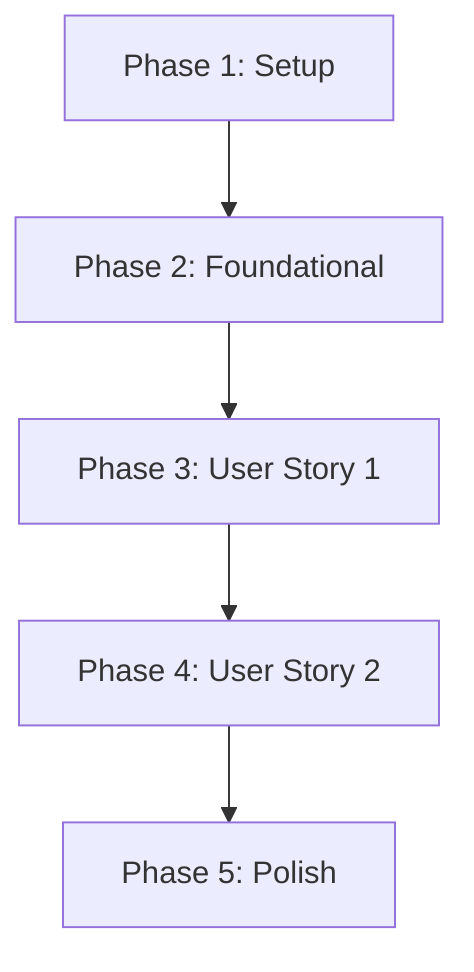

# Tasks: Resolução Automática de Captcha com Vision AI

**Feature Branch**: `014-resolucao-automatica-captcha-vision` | **Date**: 2026-07-07

## Implementation Strategy

A implementação ocorrerá de forma incremental:
1. **Configuração e Contratos**: Preparar a injeção de dependência e os modelos de configuração.
2. **Serviço Solucionador (IA)**: Construir e testar unitariamente o resolvedor de chamadas HTTP.
3. **Integração com o Loop do Playwright**: Integrar o loop de tentativas de screenshot e envio dentro da engine da automação.
4. **Fallback e Resiliência**: Garantir desvios limpos para o Modo Assistido e tratamento de erros de API.

---

## Phase 1: Setup

- [x] T001 Adicionar estrutura de configuração `"Automation:CaptchaSolver"` no arquivo [appsettings.json](file:///f:/Projetos/AI/playwright/EmissorNotaFiscal/appsettings.json)
- [x] T002 Implementar a classe de mapeamento de configuração [CaptchaSolverOptions.cs](file:///f:/Projetos/AI/playwright/EmissorNotaFiscal/Configuration/CaptchaSolverOptions.cs)
- [x] T003 Registrar `CaptchaSolverOptions` e HttpClient no injetor de dependências no arquivo [Program.cs](file:///f:/Projetos/AI/playwright/EmissorNotaFiscal/Program.cs)

## Phase 2: Foundational

- [x] T004 Criar a interface de contrato [ICaptchaSolverService.cs](file:///f:/Projetos/AI/playwright/EmissorNotaFiscal/Domain/Interfaces/ICaptchaSolverService.cs)
- [x] T005 Implementar o resolvedor HTTP compatível com a API OpenAI em [OpenAiCompatibleCaptchaSolver.cs](file:///f:/Projetos/AI/playwright/EmissorNotaFiscal/Infrastructure/Automation/OpenAiCompatibleCaptchaSolver.cs)

## Phase 3: User Story 1 - Resolução Automática no Login

- [x] T006 [P] [US1] Injetar `ICaptchaSolverService` e `IOptions<CaptchaSolverOptions>` no construtor de [ContractBasedAutomationEngine.cs](file:///f:/Projetos/AI/playwright/EmissorNotaFiscal/Infrastructure/Automation/ContractBasedAutomationEngine.cs)
- [x] T007 [US1] Implementar lógica de captura de screenshot de elemento da imagem do captcha em [ContractBasedAutomationEngine.cs](file:///f:/Projetos/AI/playwright/EmissorNotaFiscal/Infrastructure/Automation/ContractBasedAutomationEngine.cs)
- [x] T008 [US1] Implementar o loop de preenchimento, submissão (`button#jar`) e validação de sucesso em [ContractBasedAutomationEngine.cs](file:///f:/Projetos/AI/playwright/EmissorNotaFiscal/Infrastructure/Automation/ContractBasedAutomationEngine.cs)
- [x] T009 [US1] Adicionar ação de recarregar o captcha via `ReloadButton` (`a#bottle`) no loop de falha de validação em [ContractBasedAutomationEngine.cs](file:///f:/Projetos/AI/playwright/EmissorNotaFiscal/Infrastructure/Automation/ContractBasedAutomationEngine.cs)

## Phase 4: User Story 2 - Resiliência e Tratamento de Erros da API

- [x] T010 [US2] Adicionar fallback para o Modo Assistido humano ou exceção no estouro de `MaxRetries` em [ContractBasedAutomationEngine.cs](file:///f:/Projetos/AI/playwright/EmissorNotaFiscal/Infrastructure/Automation/ContractBasedAutomationEngine.cs)
- [x] T011 [US2] Implementar tratamento de erros de conexão e timeouts HTTP em [OpenAiCompatibleCaptchaSolver.cs](file:///f:/Projetos/AI/playwright/EmissorNotaFiscal/Infrastructure/Automation/OpenAiCompatibleCaptchaSolver.cs)

## Phase 5: Polish & Cross-Cutting Concerns

- [x] T012 Adicionar logs detalhados e salvamento de diagnósticos em caso de falhas consecutivas de resolução do captcha
- [x] T013 Validar compilação geral e funcionamento do resolvedor rodando no terminal:
  ```powershell
  dotnet build
  ```

---

## Dependencies



## Parallel Execution Examples

* **T006 (Injeção de dependência na engine)** pode ser desenvolvido em paralelo com **T005 (Implementação da chamada HTTP do Resolvedor)** assim que a interface **T004** estiver definida.
